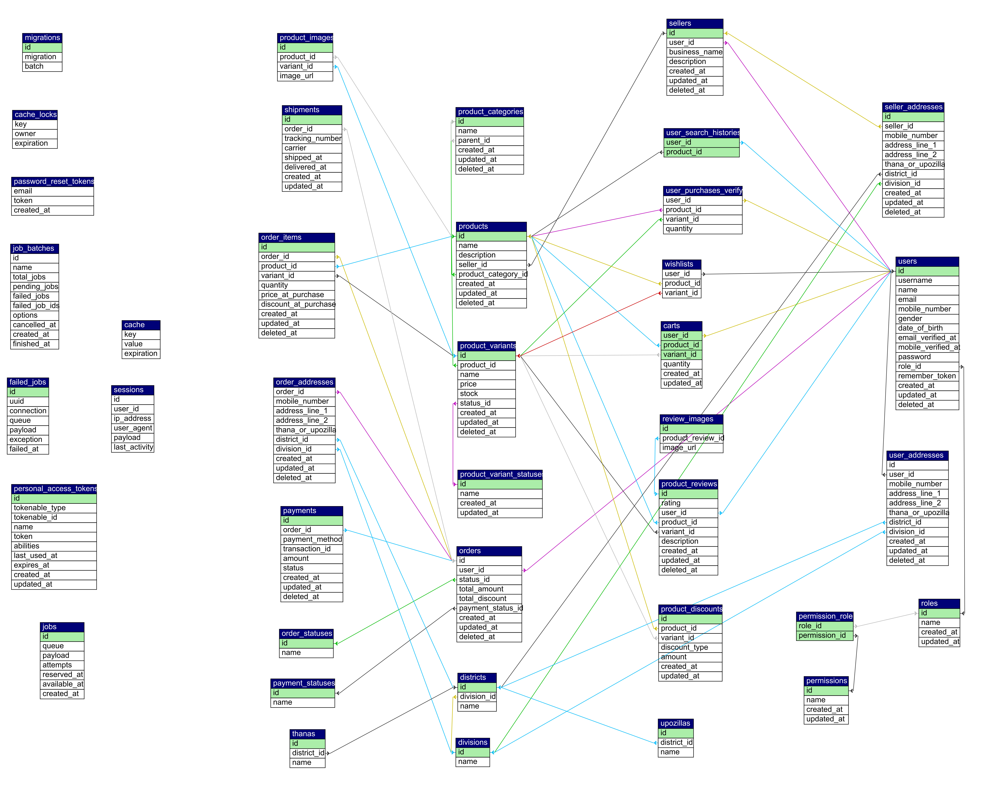

# Multi-Vendor E-Commerce Platform

This is a modern full-stack multi-vendor e-commerce platform built with **Laravel 12 (Breeze + Sanctum)** on the backend and **Vue.js + Inertia.js** on the frontend. It has multiple roles (Admin, Seller, User) and advanced business features like sales reporting by district, flexible discounts, real-time stock, and notifications across multiple channels.

---

## Table of contents

* [Project overview](#project-overview)
* [Technology stack](#technology-stack)
* [Key features](#key-features)

  * [Admin panel](#admin-panel)
  * [Seller panel](#seller-panel)
  * [User panel](#user-panel)
  * [Authentication & Security](#authentication--security)
  * [Discount system](#discount-system)

* [Database Schema](#database-schema)
  
--- 

## Project overview
This application is designed to facilitate multi-vendor commerce, featuring detailed administrative controls and seller autonomy. It highlights:

* Clear lines between what the Admin, Seller, and User are responsible for.
* Strong authentication (email and phone verification, and optional two-factor authentication).
* A discount and coupon framework that can be changed (for time, volume, referrals, and custom rules).
* Tools for running the business (invoices, district-level reports, email/SMS alerts).

---

## Technology Stack
* **Backend:** Laravel 12 along with Breeze starter kit and Sanctum for SPA/API authentication.
* **Frontend:** VueJs integrated with InertiaJs.
* **Database:** MySQL.
* **Queue:** Database.
* **Worker:** Laravel Queue Workers.
* **Notifications:** Mail, SMS.

---

## Key Features
### Admin panel
* Reports on sales and revenue by district, with filters for date range.
* Moderation of products (approve or deny new products that have been submitted).
* Approving and managing seller onboarding.
* Global coupons and discounts management (make, schedule, expire, and blacklist).
* Metrics for the dashboard, like sales, orders, active sellers, and popular products.

### Seller panel
* Create & manage product listings (images, inventory, warranty terms).
* Real-time stock visibility and stock history.
* Email or text message alerts for low stock to both the seller and the admin.
* Set up discounts for each product (percentage, fixed, or scheduled).
* Order history & basic analytics for seller.

### User panel 
* Browse categories, filters, search, and product pages.
* Add to cart, update quantities, wishlist.
* Checkout flow with invoice generation (PDF) and email delivery.
* Order tracking and order history.

### Authentication & Security
* Login/Register
* Verify user email.
* Verify mobile number.
* Can add two factor authentication.

### Discount system
* Time based coupon/discount.
* Volume based coupon/discount.
* Referral based rewards.
* Custom coupon.

---

## Database Schema

<small>Figure: Database schema for the multi vendor e-commerce web app.</small>

